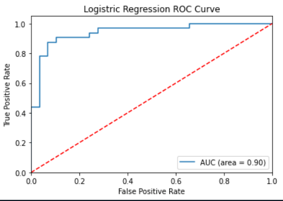

# heart-attack-analysis
A heart attack occurs when an artery supplying your heart with blood and oxygen becomes blocked. Fatty deposits build up over time, forming plaques in your heart's arteries. If a plaque ruptures, a blood clot can form and block your arteries, causing a heart attack.

